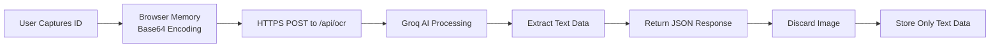
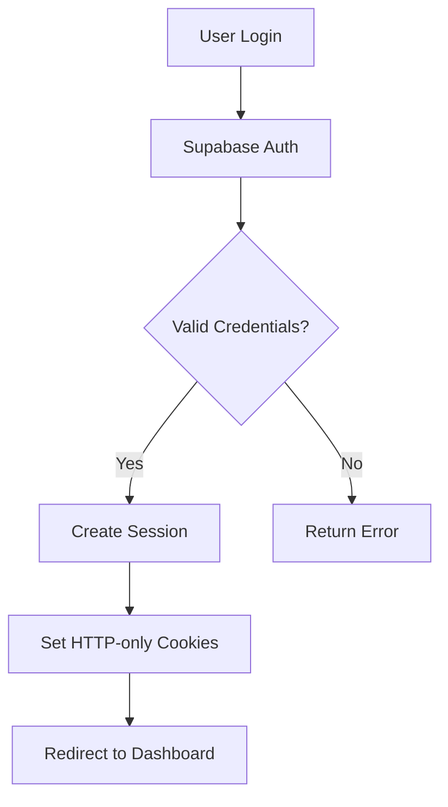

# Security & Privacy Documentation

## Overview

This document provides a comprehensive overview of the security and privacy measures implemented in the Self-Exclusion Application. The application handles sensitive personal information (PII) and ID card images, requiring robust security controls.

## Table of Contents

1. [Image Handling & Privacy](#image-handling--privacy)
2. [Data Encryption](#data-encryption)
3. [Authentication & Authorization](#authentication--authorization)
4. [API Security](#api-security)
5. [Database Security](#database-security)
6. [Compliance Considerations](#compliance-considerations)
7. [Security Best Practices](#security-best-practices)

---

## Image Handling & Privacy

### Critical Privacy Feature: No Image Storage

> [!IMPORTANT]
> **The application does NOT store ID card images anywhere.** This is a fundamental privacy-by-design principle.

### Image Lifecycle



### Detailed Flow

1. **Capture Phase**
   - User activates camera through `IDScanner` component
   - Image captured using `getUserMedia()` API
   - Image stored temporarily in React component state as base64 string
   - **Location**: Browser memory only (component state)

2. **Transmission Phase**
   - Base64 image sent via HTTPS POST to `/api/ocr` endpoint
   - Request body: `{ "image": "data:image/png;base64,..." }`
   - **Encryption**: TLS 1.2+ in transit
   - **Storage**: None - exists only in request payload

3. **Processing Phase**
   - Server-side route handler receives image
   - Image forwarded to Groq API (Llama 4 Scout model)
   - AI extracts: Name, Date of Birth, ID Number
   - **Storage**: None - processed in memory

4. **Response Phase**
   - Groq returns JSON with extracted data
   - Server validates and sanitizes response
   - Returns to client: `{ name, dateOfBirth, idNumber, confidence }`
   - **Image Discarded**: Original image never saved

5. **Cleanup Phase**
   - Component unmounts or user confirms/retakes
   - React state cleared
   - No references remain in browser storage
   - **Verification**: No localStorage, sessionStorage, or IndexedDB entries

### Where Images Are NOT Stored

❌ **Browser Storage**
- Not in `localStorage`
- Not in `sessionStorage`
- Not in `IndexedDB`
- Not in browser cache (POST requests not cached)

❌ **Server Storage**
- Not in filesystem
- Not in temporary directories
- Not in server memory after processing
- Not in logs

❌ **Database Storage**
- Not in Supabase Storage buckets
- Not in database tables
- Not in any persistent storage

✅ **Only Extracted Text Data is Stored**
- Name (string)
- Date of Birth (YYYY-MM-DD)
- ID Number (string)
- Stored in `excluded_persons` table

### Privacy Verification

You can verify this behavior by:

1. **Browser DevTools**
   - Open Network tab
   - Scan an ID card
   - Observe POST to `/api/ocr` with image in body
   - No subsequent uploads to storage endpoints

2. **Supabase Dashboard**
   - Check Storage buckets - should be empty
   - No image files present

3. **Code Review**
   - No calls to `supabase.storage.upload()`
   - No file system write operations
   - Image only exists in request/response cycle

---

## Data Encryption

### In Transit

- **HTTPS/TLS 1.2+**: All API communications encrypted
- **Groq API**: Secure HTTPS connection to AI service
- **Supabase**: All database queries over encrypted connections

### At Rest

- **Supabase PostgreSQL**: Encryption at rest enabled
- **Environment Variables**: Stored securely, not in version control
- **API Keys**: Server-side only, never exposed to client

### Data Sanitization

```typescript
// Example: XSS prevention
const sanitize = (input: string) => {
  return input.replace(/<[^>]*>/g, '');
};

// Applied to all user inputs before storage
const safeName = sanitize(extractedName);
```

---

## Authentication & Authorization

### Authentication Flow



### Implementation

- **Provider**: Supabase Auth
- **Method**: Email/Password
- **Session Management**: HTTP-only cookies (secure, SameSite)
- **Token Refresh**: Automatic via Supabase SSR

### Role-Based Access Control (RBAC)

```typescript
// User roles stored in profiles table
type UserRole = 'USER' | 'ADMIN';

// Server-side authorization check
const { data: profile } = await supabase
  .from('profiles')
  .select('role')
  .eq('id', user.id)
  .single();

const role = profile?.role || 'USER';
```

### Protected Routes

- All routes require authentication
- Unauthenticated users redirected to `/login`
- Server-side checks in page components

```typescript
// Example from page.tsx
const { data: { user } } = await supabase.auth.getUser();

if (!user) {
  redirect('/login');
}
```

---

## API Security

### API Key Management

> [!CAUTION]
> **Never commit API keys to version control**

#### Environment Variables

```env
# Server-side only (not exposed to client)
GROQ_API_KEY=gsk_...

# Client-side (public, safe to expose)
NEXT_PUBLIC_SUPABASE_URL=https://...
NEXT_PUBLIC_SUPABASE_ANON_KEY=sb_publishable_...
```

#### Key Security

- **Groq API Key**: Server-side only, never sent to client
- **Supabase Anon Key**: Public key with RLS protection
- **Rotation**: Keys should be rotated periodically

### Input Validation

```typescript
// OCR API endpoint validation
if (!image) {
  return NextResponse.json(
    { error: 'Image data is required' },
    { status: 400 }
  );
}

// Validate base64 format
if (!image.startsWith('data:image/')) {
  return NextResponse.json(
    { error: 'Invalid image format' },
    { status: 400 }
  );
}
```

### Error Handling

- **Production**: Generic error messages to client
- **Development**: Detailed errors for debugging
- **Never expose**: Stack traces, API keys, internal paths

```typescript
catch (error) {
  console.error('OCR API Error:', error); // Server-side only
  return NextResponse.json(
    { error: 'Failed to process image' }, // Generic client message
    { status: 500 }
  );
}
```

---

## Database Security

### Row Level Security (RLS)

Supabase RLS policies protect data at the database level:

```sql
-- Example RLS policy for excluded_persons table
CREATE POLICY "Users can view all exclusions"
  ON excluded_persons
  FOR SELECT
  TO authenticated
  USING (true);

CREATE POLICY "Users can insert exclusions"
  ON excluded_persons
  FOR INSERT
  TO authenticated
  WITH CHECK (true);
```

### Audit Logging

All sensitive operations are logged:

```typescript
await supabase.from('audit_logs').insert({
  user_id: user.id,
  role: 'USER',
  action: 'Added new patron',
  details: `ID: ${patron_id}, Name: ${name}`
});
```

### Data Validation

- **Date formats**: YYYY-MM-DD validated
- **Required fields**: Enforced by database constraints
- **Unique constraints**: Prevent duplicate patron IDs

---

## Compliance Considerations

### GDPR Compliance

✅ **Data Minimization**
- Only essential data collected
- Images not stored (privacy by design)
- Text data only: name, DOB, ID number

✅ **Right to Erasure**
- Patron records can be deleted
- No image data to delete

✅ **Data Portability**
- Data stored in standard PostgreSQL format
- Easy export via Supabase API

✅ **Transparency**
- Clear documentation of data handling
- Audit logs track all operations

### Privacy Best Practices

1. **Minimize Data Collection**: Only collect what's necessary
2. **Encrypt in Transit**: HTTPS for all communications
3. **No Unnecessary Storage**: Images discarded immediately
4. **Access Controls**: Authentication required
5. **Audit Trail**: All operations logged

---

## Security Best Practices

### For Developers

1. **Never Hardcode Secrets**
   ```typescript
   // ❌ Bad
   const apiKey = 'gsk_abc123...';
   
   // ✅ Good
   const apiKey = process.env.GROQ_API_KEY;
   ```

2. **Validate All Inputs**
   ```typescript
   // Sanitize user inputs
   const safeName = input.replace(/<[^>]*>/g, '');
   ```

3. **Use HTTPS Everywhere**
   - Production deployment on HTTPS
   - No mixed content

4. **Keep Dependencies Updated**
   ```bash
   npm audit
   npm update
   ```

5. **Environment-Specific Configs**
   - `.env.local` for local development
   - Vercel environment variables for production
   - Never commit `.env` files

### For Deployment

1. **Environment Variables**
   - Set in Vercel dashboard
   - Never in code or version control

2. **HTTPS Enforcement**
   - Automatic with Vercel
   - Redirect HTTP to HTTPS

3. **Security Headers**
   ```typescript
   // next.config.ts
   headers: async () => [
     {
       source: '/:path*',
       headers: [
         { key: 'X-Frame-Options', value: 'DENY' },
         { key: 'X-Content-Type-Options', value: 'nosniff' },
       ],
     },
   ],
   ```

4. **Regular Security Audits**
   - Run `npm audit` regularly
   - Review Supabase security logs
   - Monitor for suspicious activity

---

## Security Incident Response

### If API Keys Are Compromised

1. **Immediately Rotate Keys**
   - Groq: Generate new API key
   - Supabase: Rotate service role key

2. **Update Environment Variables**
   - Local: `.env.local`
   - Production: Vercel dashboard

3. **Redeploy Application**
   ```bash
   git push origin main
   ```

4. **Monitor for Abuse**
   - Check Groq usage dashboard
   - Review Supabase logs

### If Data Breach Suspected

1. **Investigate Audit Logs**
   ```sql
   SELECT * FROM audit_logs
   WHERE created_at > NOW() - INTERVAL '24 hours'
   ORDER BY created_at DESC;
   ```

2. **Review Access Patterns**
   - Unusual login attempts
   - Bulk data exports

3. **Notify Affected Users**
   - If PII compromised

4. **Implement Additional Controls**
   - Rate limiting
   - IP whitelisting
   - MFA for admin accounts

---

## Conclusion

The Self-Exclusion Application implements robust security and privacy measures, with a particular focus on protecting sensitive ID card images by never storing them. All data handling follows privacy-by-design principles, with encryption in transit, access controls, and comprehensive audit logging.

For questions or security concerns, please review the code or contact the development team.
